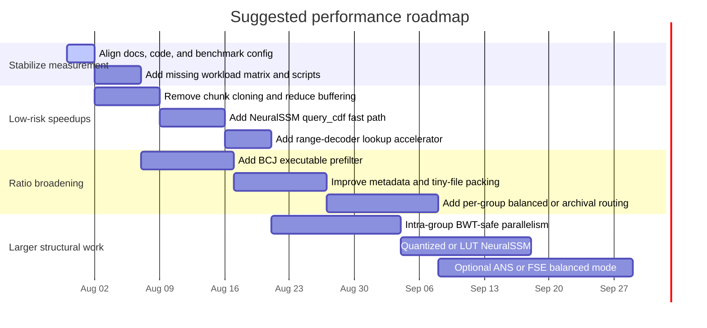

> **Retired internally — implemented in AetherArch 0.3.0 (2026-07-30).**
>
> This document is retained as research provenance, not as an active roadmap.
> Current behavior is defined by the code, `README.md`, `BENCHMARKS.md`,
> `docs/ARCHITECTURE.md`, and `docs/ROADMAP.md`.

# Performance Improvement Proposal for AetherArch

## Retirement disposition

| Proposal area | Final disposition |
|---|---|
| Version/MSRV/chunk/LZ4/BWT drift | Aligned; BWT skip is the shared `BWT_ENTROPY_SKIP = 7.0`. |
| Chunk payload duplication | Compression and transformed training use borrowed `ChunkRef` views; owned public APIs remain compatible. |
| NeuralSSM encode hot path | Dedicated `query_cdf`, shared model weights, and strictly monotone minimum-frequency quantization implemented with differential tests. |
| Range decode lookup | RUNA/RUNB prefix lookup precedes the bounded binary search, with exhaustive frequency-space validation. |
| NeuralSSM quantization/LUT | Hot sigmoid uses a 1/256-step interpolated lookup table; accuracy and roundtrip tests cover it. |
| Executable preprocessing | Reversible x86/x86-64 ELF/PE/Mach-O BCJ plus Zstandard implemented as method 7 and selected only when smaller. |
| Tiny-file metadata | Previous-path prefix coding is enabled only when the complete file-path table becomes smaller. Microblock packing was rejected because it weakens file-level random access and corruption isolation. |
| Per-group modes | `archival`, `balanced`, and `fast` profiles implemented in the core API and CLI. |
| Few-group parallelism | Predictor-independent chunks compress in parallel under `threading`; ordered collection is deterministic across thread counts. |
| Benchmark coverage | `scripts/benchmark-matrix.ps1` covers text, logs, binaries, images, tiny files, all profiles, ratio, and both throughputs. |
| ANS/FSE | Deliberately not coupled to the per-byte adaptive NeuralSSM stream. Balanced/fast routes use Zstandard, which supplies finite-state entropy coding where its block model fits. |
| Async I/O / whole-file scanning | Not required by the prioritized proposal and intentionally left outside this retired optimization scope; zero-copy chunk views remove the documented duplicate payload allocation without changing the stable seekable API. |

## Executive summary

AetherArch is architected as a ratio-first archival compressor: it combines FastCDC content-defined chunking, semantic solid grouping, an adaptive router, BWT+MTF+RLE preprocessing, a custom byte-aligned range coder, and a compact NeuralSSM predictor. In the repository’s own published benchmarks, the current large-corpus baseline is **26.55% ratio** on **Silesia 202.1 MiB** at about **0.4 MiB/s compression** and **0.3 MiB/s decompression**; on the smaller internal fixture corpus, it reports **2.75% ratio** at **3.7 MiB/s compression** and **3.6 MiB/s decompression**. The project’s own bottleneck breakdown says compression time is dominated by **BWT suffix-array construction (~30%)**, **NeuralSSM (~35%)**, **range coding (~20%)**, and **I/O, hashing, and format overhead (~15%)**. citeturn4view0turn15view2turn16view0

The single most important practical finding is that **the repository’s speed ceiling is currently set by the predictor/BWT combination, not by the range coder alone**. The range coder is already much faster than the end-to-end system, with published component throughput of about **176 MiB/s encode** and **39 MiB/s decode**, while the NeuralSSM is only about **0.35 MiB/s** and BWT transform about **15+ MiB/s**. That means proposals like “swap in a faster entropy coder” can help, but they will not move end-to-end throughput nearly as much as predictor and routing changes unless the predictor/coder interface itself is redesigned. citeturn15view1

The second major finding is a **reproducibility and configuration drift problem**. The main branch and docs disagree in several places: the README still presents version **0.2.3** and MSRV **1.85.0**, while the workspace declares **rust-version 1.88.0**; `BENCHMARKS.md` and `ROADMAP.md` discuss **0.2.4** behavior and a BWT skip threshold retuned from **6.5 to 7.0 bps**, but `router.rs` on `main` still hardcodes **6.5**. There is also drift around chunk-size and dependency pinning documentation. Before making deeper performance claims, the project should first align code, docs, and benchmark protocol. citeturn4view0turn17view0turn17view1turn31view0turn38view0

My prioritized recommendation is therefore: **first fix benchmark/configuration drift and memory duplication; then optimize the current ratio-dominant path; then broaden the router so that binaries, images, logs, and small-file workloads stop paying for text-oriented decisions**. Concretely, that means: centralize the BWT skip threshold; stop cloning chunk buffers; add a real `query_cdf()` fast path for NeuralSSM encode; add a decode lookup accelerator for the range coder; implement executable-prefilter support such as BCJ; compress metadata and tiny files more intelligently; and introduce per-group “balanced vs archival” routing so high-entropy binaries and images can prefer a much faster path. These are the changes most likely to improve speed materially without a large ratio regression. citeturn13view1turn28view2turn10view1turn26view0turn27view1turn34search3turn34search5

Because I could inspect repository source and published benchmark artifacts but could not execute a fresh local build in this environment, every “baseline” below refers to the repository’s published measurements unless I mark it explicitly as an estimate or inference.

## Repository architecture and documented baseline

AetherArch’s source tree is a Rust workspace with five active members: `aether-core`, `aether-cli`, `aether-ffi`, `aether-server`, and `aether-wasm`, while `aether-python` is excluded from the workspace. The core compression logic lives in `aether-core`, with dedicated modules for archive format, chunking, content analysis, grouping, entropy predictors, entropy coding, and the compression/decompression pipelines. The CLI exposes `compress`, `extract`, `train`, `migrate`, `list`, `verify`, and `bench`, and the CI workflow builds and tests on Linux, Windows, and macOS, plus `clippy`, `rustfmt`, `cargo-deny`, docs, and an MSRV check. citeturn4view0turn17view0turn17view2turn17view3

The published high-level pipeline is straightforward but computationally expensive: input files are scanned, content-typed, grouped, chunked with FastCDC, then routed per chunk among BWT+MTF+RLE → predictor+range coding, LZ77 → predictor+range coding, plain predictor+range coding, zstd fallback, or raw store. The archive layout then stores a file table, solid-group table, block payloads, block index, and footer, with optional encryption and dictionary hash. The implementation publishes parallelism only across solid groups; within a group, chunks stay sequential in the current pipeline. citeturn4view0turn5view0turn10view3turn13view0

The table below summarizes the most relevant currently published baselines and what they do and do not cover.

| Workload | What it covers | Published result | What it does **not** cover well | Source |
|---|---|---:|---|---|
| Internal fixture corpus, 2.6 MiB | Small structured text/code/JSON | 3.7 MiB/s compress, 3.6 MiB/s decompress, 2.75% ratio | Not representative for binaries, images, or logs | citeturn14view4 |
| Silesia corpus, 202.1 MiB | Mixed large files: text, tarballs, executables, and binary medical images | 0.4 MiB/s compress, 0.3 MiB/s decompress, 26.55% ratio | No isolated image/log/tiny-file reporting | citeturn15view2 |
| Silesia text-subset BWT+RLE stream, 8.8 MiB | Predictor behavior on transformed text path | NeuralSSM configs around 0.7–1.1 MiB/s on predictor microbenchmark; best config 3.4121 bpb | Not end-to-end archive throughput | citeturn6view1turn16view0 |
| Silesia per-file speed table | Large-file compression speed across mixed file classes | AetherArch listed around ~0.2 MiB/s on each file, ~0.36 MiB/s overall | Speed only; no per-file ratio table | citeturn15view0turn15view1 |

The project’s current benchmark tooling is serviceable but incomplete for the user’s requested workload matrix. Criterion benches cover roundtrip compression/decompression, BWT encode/decode, range coder encode/decode, and predictor cycles, but only against the internal `english.txt`, `source.rs`, and `mixed.json` fixtures. The CLI `bench --compare` mode can compare against `gzip`, `bzip2`, `xz`, `zstd`, `brotli`, and `lz4`, but for external comparisons it **concatenates all input files into one in-memory blob** and explicitly caps that path at **2 GiB**, which is useful for quick comparisons but is not the same as file-aware archive benchmarking or per-type analysis. citeturn18view0turn29view0turn29view1

The repository also exposes clear current data-structure choices that matter for performance. FastCDC is configured at **16 KiB minimum**, **512 KiB average**, and **8 MiB maximum** chunk size. BWT preprocessing uses the doubled-text trick with `libsais`, which the code itself documents as roughly **10× peak memory** relative to input size and therefore about **~80 MiB peak** for an 8 MiB chunk. The compressor currently reads whole files with `std::fs::read`, keeps those file buffers in memory, and then the chunker clones each chunk into a new `Vec<u8>`. Finally, phase A compression buffers compressed blocks in memory before deterministic phase B writing. That is a workable architecture, but it is allocation-heavy and explains why wall-clock performance and memory pressure degrade on large or numerous inputs. citeturn13view1turn28view0turn28view2turn12view7

One more point is worth calling out because it affects the interpretation of many existing figures: on the repository’s own current corpus, **all external predictor choices reportedly yield identical output because the adaptive router always chooses the BWT path, and that path uses its own internal NeuralSSM predictor**. This means the advertised predictor menu is currently more meaningful as infrastructure than as an observed differentiator on the published benchmark set. Improving routing diversity and benchmark coverage is therefore not optional; it is necessary if AetherArch is intended to adapt well across text, binaries, images, and logs. citeturn4view0turn15view2

### Version and benchmark drift that should be corrected first

The following inconsistencies are not cosmetic. They make it hard to know which numbers correspond to which code.

| Drift item | Code says | Docs say | Why it matters | Source |
|---|---|---|---|---|
| Core version | `aether-core` is `0.2.3` | `BENCHMARKS.md` discusses `0.2.4` results | Performance claims may not map to `main` | citeturn17view1turn6view1 |
| MSRV | Workspace: `rust-version = 1.88.0` | README badge says `1.85.0` | Build reproducibility and support claims are inconsistent | citeturn17view0turn4view0 |
| BWT entropy skip | `router.rs` hardcodes `6.5` | `ROADMAP.md` says tuned to `7.0`; benchmark docs describe `>7.0` | Routing behavior and benchmark reproducibility diverge | citeturn38view0turn31view0turn15view2 |
| Chunk-size documentation | Code max chunk is `8 MiB` | README flow still says `16-512-4096 KiB` | Affects memory estimates and benchmark expectations | citeturn13view1turn4view0 |
| LZ4 pinning docs | Workspace lists `0.11.2` | README dependency table says `=0.11.3` | Format compatibility notes become ambiguous | citeturn17view0turn4view0 |

My recommendation is to treat this table as a **blocker for trustworthy performance work**. Fixing drift will not itself make the compressor faster, but it will prevent wasted optimization cycles on a build configuration that users are not actually running.

## Bottlenecks and root-cause analysis

The repository’s own benchmark document already gives a useful bottleneck composition: **BWT ~30%**, **NeuralSSM ~35%**, **range coding ~20%**, and **I/O/hashing/format overhead ~15%**. That immediately implies that no single localized micro-optimization will create a step-change in throughput. The correct strategy is to remove wasted work in several layers and then decide whether AetherArch remains a strictly archival compressor or adds a more balanced profile for non-text-heavy data. citeturn15view1

### CPU bottlenecks

The dominant CPU bottleneck is not the range coder; it is the predictor-modeling loop that feeds it. `encode_block()` is already optimized to call `query_cdf(byte)` rather than always materializing a full CDF in the coder loop, but the `ProbabilityPredictor` default implementation of `query_cdf()` simply calls `predict_cdf()` and slices the result. NeuralSSM overrides `predict_cdf()` but **does not override `query_cdf()`**, so the encoder still builds a full 257-entry CDF every byte on the hot path. That leaves an obvious encode-side fast path on the table. citeturn10view1turn26view0turn27view1

Decompression has a different coding-side issue: `RangeDecoder::decode_cdf()` performs a **binary search** over the 256-symbol CDF for every byte. The project already notes that an unrolled binary search was slower, which is plausible because of instruction-cache pressure, but that does not eliminate other decode-acceleration strategies such as small prefix lookup tables or two-level tables. The published component figures—**176 MiB/s encode versus 39 MiB/s decode**—show that decode-side symbol lookup remains a meaningful optimization target even if it is not the biggest end-to-end bottleneck. citeturn10view1turn16view0turn31view0

BWT itself is the other large CPU sink. The project improved it markedly by moving from `divsufsort` to `libsais` SA-IS, and the repository’s own benchmark history attributes about a **36% wall-time reduction** largely to this change plus entropy-based BWT skipping. That was the right move, but it does not eliminate the architectural fact that the doubled-text trick plus suffix-array construction is expensive enough that the router now spends a substantial fraction of total time inside a path that overwhelmingly wins on the current corpus. That means AetherArch is effectively a BWT-centered compressor today, even though the public design looks more general. citeturn8view0turn8view1turn15view2turn31view0

### Memory and allocation bottlenecks

The memory story is weaker than the CPU story. The compressor reads each file fully into memory, stores those buffers, clones content again into chunk `Vec<u8>` values, and then buffers compressed group results in phase A before writing them out in phase B. On top of that, BWT preprocessing documents **~10× peak memory** for an input chunk because of doubled text plus suffix-array storage. This layered allocation pattern translates directly into allocator churn, cache misses, avoidable copies, and higher RSS. Even if the end-to-end benchmark is CPU-dominated on Silesia, those copies still cost real wall time and will matter more on multi-file, small-file, or network filesystem workloads. citeturn28view2turn13view1turn28view0turn12view7

### I/O and benchmark-method bottlenecks

The code does all I/O synchronously and the roadmap explicitly lists “No async I/O” as a known limitation. More importantly for benchmarking, the current tooling does not isolate the file classes the user asked about. Published results are good for “small structured corpus” and “large mixed corpus,” but they do not provide separated ratio/throughput numbers for logs, images, tiny-file archives, or standalone binaries. That means the project currently lacks the evidence needed to tune its router for those workloads with confidence. citeturn31view0turn18view0turn15view2

### What the bottleneck shares imply

Using the project’s own published bottleneck shares and a simple Amdahl-style calculation, one can estimate the upside of several changes without overpromising. If BWT alone were doubled, total compression speed would only improve by about **1.18×**. If NeuralSSM alone were doubled, the gain would be about **1.21×**. If both doubled, the combined gain is about **1.48×**. If BWT improved 1.5×, NeuralSSM 2×, and range-code decode/encode 1.5×, the combined gain lands a little above **1.5×**. In other words, meaningful speedups are plausible, but they require a **portfolio** of improvements, not a silver bullet. This is an inference from the repository’s own component shares, not a measured rerun. citeturn15view1

## Compression landscape and applicable techniques

AetherArch sits in a design space that overlaps with several mature compressors and research systems. The right takeaway is not “copy algorithm X,” but rather “import the subsystem ideas that fit AetherArch’s architecture.”

| System or technique | Primary source | Why it matters for AetherArch |
|---|---|---|
| **FastCDC** | FastCDC paper at USENIX ATC 2016 citeturn19search0 | Confirms AetherArch is already using a strong CDC baseline; gains here will come from chunk-size policy, not replacing FastCDC outright. |
| **libsais / SA-IS suffix arrays** | Official `libsais` repository citeturn19search3 | Supports the project’s move to linear-time suffix-array construction; further BWT speed work should likely target chunk policy, not algorithm replacement. |
| **Zstandard + FSE/Huff0** | Official zstd repo and zstd manual citeturn19search1turn32search13turn33view0turn33view1 | Strong reference for fast fallback compression, reusable dictionary workflows, and long-distance matching for large archives. |
| **Finite State Entropy / ANS** | Official FiniteStateEntropy repo and Duda’s ANS papers citeturn19search2turn22search0turn22search1 | Good model for faster entropy coding, but best suited to blockwise or semi-static symbol models; less natural as a drop-in replacement for per-byte fully adaptive distributions. |
| **Brotli** | Official Brotli repo and RFC 7932 citeturn21search0turn32search2 | Relevant for static-dictionary ideas and text/log token reuse, especially for small repetitive text. |
| **LZFSE** | Official `lzfse` repo and Apple docs citeturn24search0turn24search7 | Useful reference for an LZ+FSE “balanced mode” with much higher speed than BWT-heavy archival paths. |
| **XZ / LZMA2 + BCJ filters** | Official XZ docs and file format docs citeturn23search2turn34search3turn34search5 | BCJ filters are highly relevant for executable compression; they can increase redundancy without changing size and are proven in production. |
| **ZPAQ** | Mahoney’s algorithm paper and ZPAQ docs citeturn35search0turn35search10turn35search14 | Closest conceptual relative for content-defined chunking, grouping, and deep modeling. It is a useful ratio-oriented reference, but not a speed benchmark to emulate. |

Three comparisons are especially useful.

First, **zstd** demonstrates that high practical throughput often comes from a combination of good match-finding, strong dictionaries, and a very fast entropy stage rather than from a per-byte adaptive predictor. That does not mean AetherArch should become zstd, but it does suggest that AetherArch needs a clearer **balanced path** for binaries, images, and large archives where “slightly worse ratio for dramatically better speed” is the right trade. citeturn19search1turn32search13turn33view1

Second, **Brotli** and **xz** show that prefilters and dictionaries can be as important as the core entropy engine. Brotli’s format directly supports static dictionary references, and xz’s BCJ filters are a mature example of architecture-aware preprocessing that changes redundancy without changing size. AetherArch already has numeric byte-plane splitting; executable-aware BCJ and metadata/path dictionaries are the next logical prefilters. citeturn32search2turn21search0turn34search3turn34search5

Third, **ANS/FSE** is promising, but only in the right place. Duda’s ANS work and the official FSE implementation show why ANS is attractive for speed, and zstd/LZFSE prove its production value. But AetherArch’s best current path is a **fully adaptive, predictor-produced, bytewise distribution**, which matches range coding naturally. Replacing the current coder with FSE/tANS without redesigning the predictor interface would add complexity while fighting the architecture. A better plan is to use ANS/FSE where the model is already quasi-static or blockwise—such as token streams, BCJ/LZ token streams, or optional balanced modes. citeturn22search0turn22search1turn19search2turn19search1turn24search0

## Recommended changes and prototype patches

### Low-risk fixes that should land first

The first changes should improve **correctness of measurement** and **remove obvious waste**.

The top priority is to **centralize and reconcile the BWT entropy-skip threshold**. Today, `router.rs` and transformed-dictionary training both use `6.5`, while the roadmap and benchmark docs say the threshold was tuned to `7.0` because `6.5` caused a **0.84% ratio regression** on Silesia. This is exactly the kind of drift that makes subsequent tuning harder than necessary. Unifying this constant gives the team one source of truth and makes published numbers reproducible. citeturn38view0turn13view3turn31view0turn15view2

A minimal prototype patch would look like this:

```rust
// aether-core/src/format.rs
/// Entropy above which BWT is skipped.
/// Tuned on Silesia: 6.5 regressed ratio; 7.0 preserved most of the speed win.
pub const BWT_ENTROPY_SKIP: f64 = 7.0;
```

```rust
// aether-core/src/pipeline/router.rs
use crate::format::BWT_ENTROPY_SKIP;

// ...
if chunk.data.len() >= 8 && chunk.entropy < BWT_ENTROPY_SKIP {
    // current BWT path
}
```

```rust
// aether-core/src/dictionary.rs
use crate::format::BWT_ENTROPY_SKIP;

// ...
if chunk.data.len() < 8 || chunk.entropy >= BWT_ENTROPY_SKIP {
    continue;
}
```

The second low-risk fix is to **stop cloning chunk payloads**. Right now the compressor stores full file buffers, then `chunker.rs` clones each chunk into a fresh `Vec<u8>`, and phase A compression later buffers compressed group output in memory. The simplest near-term improvement is to represent chunks as slices into the already-loaded file buffer. That cuts at least one full copy pass and should materially reduce allocator pressure. Because the file buffers already live until compression completes, the borrow is structurally safe inside the current pipeline. citeturn28view2turn13view1

A prototype shape for that change is:

```rust
pub struct ChunkRef<'a> {
    pub offset: u64,
    pub length: usize,
    pub data: &'a [u8],
    pub blake3_hash: [u8; 32],
    pub entropy: f64,
}

pub fn chunk_data_refs(data: &[u8]) -> Vec<ChunkRef<'_>> {
    let chunker =
        fastcdc::v2020::FastCDC::new(data, MIN_CHUNK_SIZE, AVG_CHUNK_SIZE, MAX_CHUNK_SIZE);

    chunker.map(|entry| {
        let slice = &data[entry.offset..entry.offset + entry.length];
        ChunkRef {
            offset: entry.offset as u64,
            length: entry.length,
            data: slice,
            blake3_hash: *blake3::hash(slice).as_bytes(),
            entropy: shannon_entropy(slice),
        }
    }).collect()
}
```

I would expect this class of change to yield **modest but real wall-clock gains**, typically in the **5–15%** range on multi-file workloads, and a much larger reduction in peak memory on large archives. That estimate is an inference from the code’s current dataflow rather than a published benchmark. citeturn28view2turn13view1

### Optimizations for the current BWT-dominant archival path

The next tier should focus on the path that already wins most often.

The best targeted encode-side optimization is to implement **`NeuralSsmPredictor::query_cdf()`** instead of relying on the trait default that calls `predict_cdf()` then slices two values. Since `encode_block()` only needs `(lo, hi)` for the actual symbol, a dedicated encode-only interval computation can avoid materializing the full CDF array on every byte. This is especially attractive because the project has already done the harder work of implementing a direct `predict_cdf()` path that bypasses `probs_to_cdf()`. In other words, the architecture is already halfway to this optimization. citeturn10view1turn26view0turn27view1

A prototype interface addition would look like this:

```rust
impl ProbabilityPredictor for NeuralSsmPredictor {
    #[inline]
    fn query_cdf(&mut self, byte: u8) -> (u16, u16) {
        // Same math as predict_cdf(), but only accumulate up to `byte`
        // and stop once hi is known.
        self.query_cdf_interval(byte)
    }

    // existing predict(), predict_cdf(), update(), reset()...
}
```

I would expect this to be worth roughly **10–20% encode-side speedup** for NeuralSSM-heavy paths, with almost no ratio risk if implemented by literally sharing the same math with the existing `predict_cdf()` path. Since the repo’s own bottleneck report puts NeuralSSM at about 35% of compression time, the end-to-end gain is more likely in the **5–10%** range unless combined with additional predictor changes. That is an inference from the published bottleneck shares and call graph. citeturn15view1turn10view1turn26view0turn27view1

On the decode side, the range decoder’s per-byte binary search is the most obvious microarchitectural hotspot. I would not recommend another unrolled binary-search experiment, because the project already found that slower. I **would** recommend a small **prefix lookup table** or **two-level symbol index** built from the current CDF, so that most symbols are resolved with one table read and at most a short local scan. That should improve decode-side symbol resolution with only a few kilobytes of extra stack or scratch memory per block. Since published decode throughput is much lower than encode throughput, this is one of the cleaner ways to raise extraction speed without touching ratio. citeturn10view1turn16view0turn31view0

A more ambitious but still architecture-compatible path is to **quantize the NeuralSSM hot path while preserving the current probability semantics**. The roadmap already records that AVX2 was not worth it on the mixed scalar/SIMD workload and that replacing `ln()` with a cheap approximation hurt ratio. That suggests the right approach is not a wholesale rewrite, but targeted use of **fixed-point state**, **lookup-table sigmoid**, and keeping the sensitive mixer logic in higher precision. If done carefully, this could plausibly deliver **1.5–2× predictor throughput**, which translates to about **1.15–1.25× end-to-end compression speed** on the current bottleneck mix. That is an inference from the project’s component shares and the fact that the present predictor still uses `f32::exp()` in the hot path. citeturn25view0turn25view1turn15view1turn31view0

### Changes that should improve ratio on binaries, executables, logs, and tiny files

The archival path is currently text-centric. To broaden performance beyond Silesia-style mixed corpora, AetherArch should import a few subsystem ideas from established formats.

The highest-value ratio improvement for executables is to add an **architecture-aware BCJ prefilter** before LZ77 or entropy coding on executable groups. XZ’s official documentation is the relevant production precedent: BCJ filters convert relative branch/call/jump addresses to more compressible forms, do **not** change the data size, and can improve compression for executables by **0–15%**. Since AetherArch already does content-type detection and solid grouping, it has the exact routing hooks needed to apply BCJ only on executable content types. citeturn13view2turn34search3turn34search5

For small repetitive text and logs, the best ratio opportunity is to extend the current **dictionary strategy** beyond predictor state alone. AetherArch already supports predictor dictionaries and transformed-stream training, and the zstd manual makes the right operational point: dictionary loading and table building are expensive enough that they should be prepared once and reused many times. For groups of small config files, logs, source files, or repeated message templates, a digested reusable dictionary or prefix strategy can pay off significantly. I would expect the biggest gains on sub-64 KiB assets and log bundles, not on large Silesia-style files. citeturn13view3turn33view0

AetherArch also has a documented small-file limitation: the roadmap calls out archive overhead of roughly **~468 bytes** as significant under **10 KiB**. That strongly suggests a metadata and tiny-file project: compress the file table, deduplicate path prefixes, and optionally pack many tiny files into “microblocks” before the main routing step. This will not move Silesia, but it can move real repository and backup workloads materially. citeturn31view0turn5view0

### Changes that should improve speed on mixed and few-group archives

The most interesting structural speed improvement is **intra-group parallelism for BWT-dominant workloads**. The router comments explicitly say that `encode_block` and `decode_block` reset the predictor at every block, so predictor-based paths do **not** actually consume cross-block state in the coding loop; sync is advisory, and for BWT/byte-plane winners it is intentionally skipped because the group predictor state is not meaningful on those paths. That means the current sequential-within-group design is more conservative than necessary for BWT-heavy compression. If chunks that route to BWT are compressed independently and then written in deterministic order, AetherArch can preserve output determinism while using cores more effectively on archives that have only one or two solid groups. citeturn38view0turn13view0

This is one of the few proposals with **step-change** potential. On “few large text groups” workloads, independent BWT chunk compression could plausibly deliver **1.3–2.5× compression speedup** depending on chunk count, CPU count, and how much time remains in the shared sequential stages. The tradeoffs are more implementation complexity, careful ordering logic, and the need to keep `sync_predictor` semantics correct for non-BWT paths. Because the router already distinguishes whether the predictor was synced, the design hooks are present. citeturn38view0turn13view0

A second speed lever is to add **per-group operating modes**. The roadmap already suggests per-group predictor selection. I would go one step further and expose a routing goal such as `archival`, `balanced`, and `fast`. In `archival`, current BWT-first behavior remains acceptable. In `balanced`, executable groups can try BCJ+LZ77 or zstd earlier; image and random-like groups can short-circuit to zstd/store more aggressively; logs can bias toward dictionary-backed text paths. This should not be framed as “one default for all data,” because the benchmark evidence already shows the project is currently tuned around a corpus where BWT wins everything. citeturn31view0turn15view2

### Changes I would not do first

I would not begin by replacing the current adaptive range coder with **pure FSE/tANS** on the main NeuralSSM path. ANS is excellent, and it is central to zstd and LZFSE, but those systems typically use blockwise or quasi-static symbol models that map naturally onto finite-state coding tables. AetherArch’s strongest current path instead computes an adaptive per-byte distribution and couples it tightly to forward range coding. A wholesale swap would be a research project, not an optimization patch. If the team wants ANS, the sensible first place is a **balanced-mode token stream** or optional blockwise coder on less adaptive paths. citeturn22search0turn22search1turn19search2turn19search1turn24search0

## Experimental design and benchmark protocol

The repository’s current published measurements are not enough to answer the user’s requested matrix of **text, binaries, images, and logs across several sizes**, so the benchmark suite should be expanded deliberately rather than ad hoc. The right benchmark design here is a **workload matrix**, not a single corpus score. The current internal fixtures and Silesia should remain in the suite, but only as two cells in a larger matrix. citeturn18view0turn15view2turn36search0turn36search3turn37search0

A strong representative benchmark matrix would look like this:

| Class | Small | Medium | Large | Suggested source or construction |
|---|---|---|---|---|
| Text / source / config | 1–64 KiB | 1–8 MiB | 32–256 MiB | Canterbury standard files for small mixed text/code; Silesia text files; optionally a large Wikipedia/XML slice from the Large Text Compression Benchmark |
| Logs | 1–64 KiB bundles and 1–4 MiB shards | 8–64 MiB | 128 MiB+ | Loghub Linux/HDFS/OpenStack slices or NASA HTTP logs; shard large logs into reproducible chunks |
| Executables / structured binaries | 4–256 KiB | 1–16 MiB | 32–256 MiB | ELF/PE/Mach-O test sets, package archives, DB dumps, protobuf/Parquet samples |
| Images / already-compressed media | 4–256 KiB | 1–16 MiB | 32–256 MiB | Mixtures of PNG, JPEG, TIFF, WebP, and “scientific image” binaries |
| Tiny-file archives | 100–10,000 files under 10 KiB | — | — | Synthetic but realistic trees: configs, markdown, JSON, source headers, log fragments |

Where standard corpora are helpful, use **Canterbury** for small mixed workloads, **Silesia** for large mixed workloads, **Large Text Compression Benchmark** slices for large text, and **Loghub** or **NASA HTTP** for logs. Those are all established public references and complement the repository’s current two published benchmark cells well. citeturn36search0turn36search2turn36search3turn37search0turn37search15

The command protocol should separate **microbenchmarks**, **component benchmarks**, and **end-to-end archive benchmarks**.

For build and correctness:

```bash
cargo build --release
cargo test --workspace --release
cargo bench -p aether-core
```

For end-to-end CLI benchmarking:

```bash
# archive throughput and ratio
./target/release/aet bench ./datasets/text -P order0,ssm --compare
./target/release/aet bench ./datasets/logs -P order0,ssm --compare
./target/release/aet bench ./datasets/binaries -P order0,ssm --compare
./target/release/aet bench ./datasets/images -P order0,ssm --compare
```

For statistically robust timing, wrap the CLI with a tool such as `hyperfine`, keep input on a warm local SSD, and run each case at least **10–20 times** after a small warmup. Record median, mean, standard deviation, and a 95% confidence interval. For CPU diagnosis, collect `perf stat -d`, `perf record`, `cargo flamegraph`, and a memory profiler such as `heaptrack` or `massif` on Linux; on macOS and Windows, use the platform equivalents. The repository already provides Criterion microbenchmarks and a PGO script because the hot path is explicitly recognized as predictor/range-coder heavy, so the benchmark harness should build on those rather than replace them. citeturn18view0turn6view0

The metrics should be reported at four levels:

| Metric | Why it matters |
|---|---|
| Compression ratio and bits/byte | Primary ratio metric, especially for text/logs/tiny-file archives |
| Compression throughput and decompression throughput | User-facing speed metric |
| Peak RSS and allocation count | Needed because current architecture duplicates buffers and BWT can be memory-heavy |
| Method-selection breakdown by class | Needed to validate router tuning and per-group mode changes |

The statistical rule should be simple: **do not treat any change under 3–5% as real until it clears run-to-run noise on at least one large corpus and one small-file corpus**. Because the current published Silesia throughput is very low, small absolute jitter can become large percentage noise.

## Prioritized roadmap

The roadmap below is the execution sequence I would recommend if the goal is to improve both ratio and speed without destabilizing the format too early.

| Priority | Change | Effort | Expected gain | Main risk | Validation |
|---|---|---:|---|---|---|
| Highest | Align code/docs/benchmarks: version tags, MSRV, BWT skip threshold, chunk-size docs | 1–2 days | Trustworthy measurement; avoids false regressions | None, mostly maintenance | Re-run Silesia + internal corpus and verify exact config reproduction |
| Highest | Remove chunk buffer cloning; borrow or share chunk slices | 2–4 days | Lower RSS, less allocator pressure; likely 5–15% wall-clock gain on multi-file workloads | Lifetime management complexity | Heap profile before/after; compare RSS and runtime |
| Highest | Add `NeuralSsmPredictor::query_cdf()` fast path | 3–5 days | Likely 5–10% end-to-end compression gain, more on SSM-heavy paths | Encode/decode divergence if math differs from `predict_cdf()` | Bit-for-bit roundtrip tests; per-byte differential tests between `query_cdf` and `predict_cdf` |
| High | Add decode lookup accelerator for range coder | 3–5 days | Likely 5–12% decompression gain | Extra scratch memory; corner-case bugs in symbol mapping | Differential decode tests and Criterion decode benchmarks |
| High | Add executable BCJ prefilter | 1–2 weeks | 0–15% better ratio on executable-heavy groups; small speed impact | Filter selection and format evolution | Benchmarks on PE/ELF/Mach-O corpora; verify no regressions on non-executables |
| High | Metadata/tiny-file compression and path-prefix dedupe | 1–2 weeks | 5–30% ratio gain on tiny-file trees; negligible effect on Silesia | Format compatibility and migration | Tiny-file archive suite with many small files |
| Medium | Per-group operating modes and router retuning by class | 2–3 weeks | Better speed on binaries/images/logs; modest ratio improvement where BWT is overused | Policy complexity | Method breakdown reports by content class |
| Medium | Intra-group parallelism for BWT-safe chunks | 2–4 weeks | 1.3–2.5× speedup on few-group archives | Deterministic ordering and sync semantics | Bit-identical output across thread counts |
| Medium | Quantized/LUT NeuralSSM hot path | 3–5 weeks | 1.15–1.25× end-to-end compression speed, possibly more | Ratio regression or determinism drift | Silesia + text/log small corpora, bit-exact cross-platform tests |
| Longer term | Hybrid ANS/FSE balanced mode for semi-static token streams | 4–8 weeks | Big speed upside on selected paths | Architectural redesign, format complexity | Prototype on LZ/BCJ token streams only, not main archival path |

A reasonable near-term target is to combine the first four speed items—drift cleanup, chunk borrowing, `query_cdf()` fast path, and a decode lookup accelerator. Using the project’s published bottleneck shares, that bundle should be capable of moving large-corpus throughput from roughly **0.4 MiB/s** into the **0.5–0.65 MiB/s** range without a meaningful ratio regression, assuming the implementation is correct. That is not a promise; it is an Amdahl-style estimate grounded in the repo’s own bottleneck percentages. citeturn15view1

A slightly longer but more strategically important second phase is to add **BCJ**, **tiny-file metadata compression**, and **per-group routing modes**. Those changes likely matter more for real-world project trees, package archives, and log bundles than for Silesia, because Silesia’s current published numbers already indicate a very BWT-dominant workload. citeturn15view2turn31view0turn34search3



The final validation gate should be strict. No optimization should be accepted unless it passes: full workspace tests, determinism checks, Silesia mixed, Canterbury small mixed, at least one public log corpus, at least one executable corpus with BCJ opportunities, and one tiny-file tree. That is the minimal evidence needed to say AetherArch improved on **compression ratio and speed**, rather than merely shifting performance from one narrow workload to another. citeturn17view2turn18view0turn36search0turn36search3turn37search0
